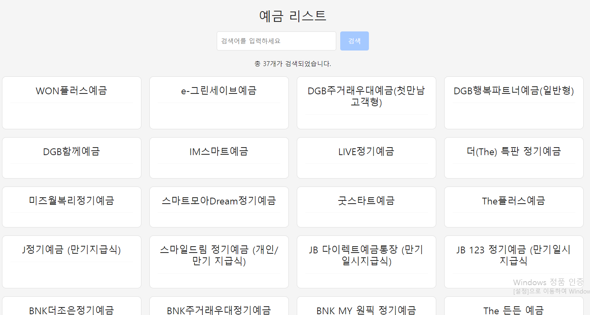

### 금융 상품 비교 애플리케이션
# 1억 클럽

### 목차
1. [팀원 정보 및 업무 분담 내역](#팀원-정보-및-업무-분담-내역)
2. [설계 내용 (아키텍처 등) 및 실제 구현 정도](#설계-내용-아키텍처-등-및-실제-구현-정도)
3. [데이터베이스 모델링(ERD)](#데이터베이스-모델링erd)
4. [금융 상품 추천 알고리즘에 대한 기술적 설명](#금융-상품-추천-알고리즘에-대한-기술적-설명)
5. [서비스 대표 기능들에 대한 설명](#서비스-대표-기능들에-대한-설명)

## 팀원 정보 및 업무 분담 내역
- 프로젝트 기간 : 2024/05/16 ~ 2024/05/23

|이름|역할 및 구현 기능|
|---|---|
|이규석| 예금, 적금 상품, Database, FE, CRUD |
|송창용| 주식 상품, DataBase, 추천 알고리즘 |

## 설계 내용 (아키텍처 등) 및 실제 구현 정도
- 로그인, 로그아웃, 회원 가입, 비밀번호 변경 등 인증 관련 - O
- 회원 개인의 자산 포트폴리오 확인 - O
- 금융 상품의 목록과 검색 - O
- 개별 금융 상품의 상세 정보 - O
- 상장 기업의 웹 사이트로 redirect - O
- 금융 상품 별 비교 - X
- 개인 정보를 기반으로 한 포트폴리오 추천 시스템 - O
- 포트폴리오 각 자산의 투자액, 예상 수익 계산 - X
- 실시간 증권 정보를 반영한 차트 정보 제공 - O
- 지수 상품, 환율 정보를 케러셀에 렌더링 - X

설계한 기능 10개 중 7개를 수행해 약 70% 정도 구현하였다.

### 🖥 기술 스택
**🌕 front**

- language
    - javascript
- framework
    - vue3
    - pinia
    - axios
    - chart.js

**🌑 back**

- language
    - python
- framework
    - django
    - django-rest-framework
    - dj-rest-auth
    - pandas

### 컴포넌트 구조

## 데이터베이스 모델링(ERD)

## 금융 상품 추천 알고리즘에 대한 기술적 설명
### 추천 알고리즘 1️⃣. 
사용자로부터 입력받은 데이터를 추출하여 LightGBM 라이브러리를 통해 생성한 모델을 통해 최적의 투자 상품을 예측합니다.  

### 추천 알고리즘 2️⃣.
사용자로부터 입력받은 데이터 중 연령대와 소득 구간에 해당하는 유저를 찾고, 그에 맞는 금융 상품을 분류하고, 추천합니다.  
만약 없다면, 일반적인 소득 구간에서 추천합니다.

## 서비스 대표 기능들에 대한 설명

### 1️⃣ 메인 페이지

  

메인 페이지에는 인기 금융 상품을 보여주는 막대 그래프를 보여줍니다.

### 2️⃣ 로그인, 회원가입 페이지
  

로그인 실패 시 팝업을 통해 오류의 원인을 설명합니다.

  

회원가입 시 비밀번호는 이메일과 비슷해서는 안 되고, 8자 이상을 사용해야 하는 등 유효성 검사를 수행합니다.

비밀번호 변경 기능도 추가하였습니다.

### 3️⃣ 마이 페이지
  

마이페이지에서 사용자 정보을 확인할 수 있으며, 투자 성향은 파이 차트로 확인할 수 있습니다.

  

예금, 적금, 증권 상품 별 정보 확인이 가능합니다.

가입한 상품의 만기와 납입액, 이자율, 총액을 한 눈에 확인할 수 있습니다.

### 4️⃣ 금융 상품 추천 페이지
  

상품 추천을 위한 데이터를 입력하는 페이지입니다.

  

추천 알고리즘을 통한 결과를 확인할 수 있습니다.

### 5️⃣ 금융 상품 페이지

전체 예금 상품을 확인할 수 있으며 클릭을 통해 상세 정보를 확인할 수 있습니다.

전체 적금 상품을 확인할 수 있으며 클릭을 통해 상세 정보를 확인할 수 있습니다.

전체 증권 종목를 확인할 수 있으며 클릭을 통해 상세 정보를 확인할 수 있습니다.

해당 주식의 기업 정보도 살펴볼 수 있습니다.
